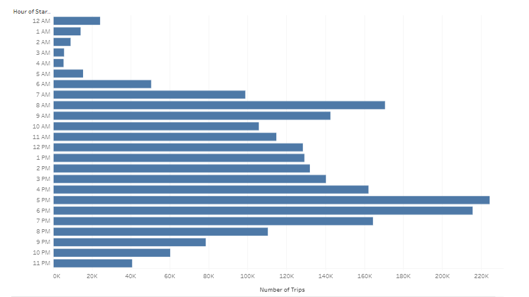
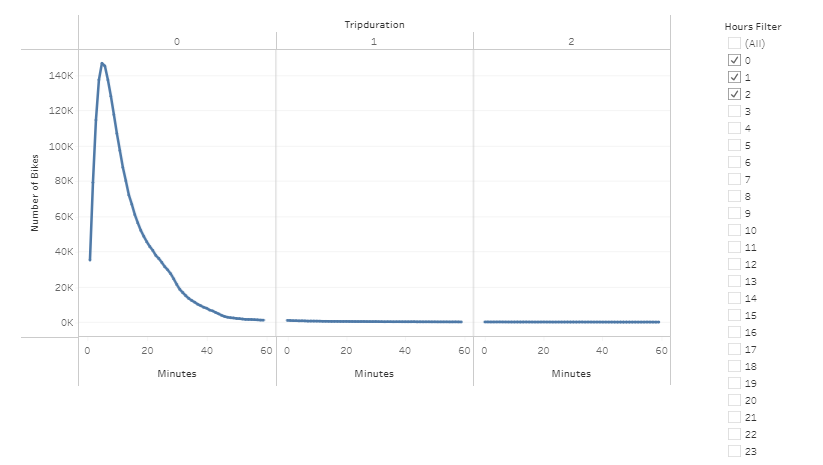
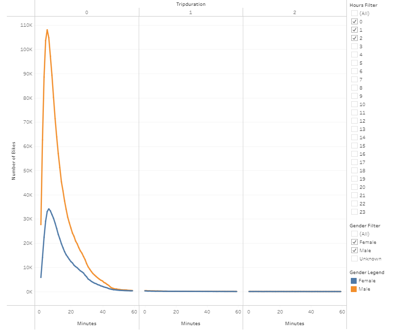
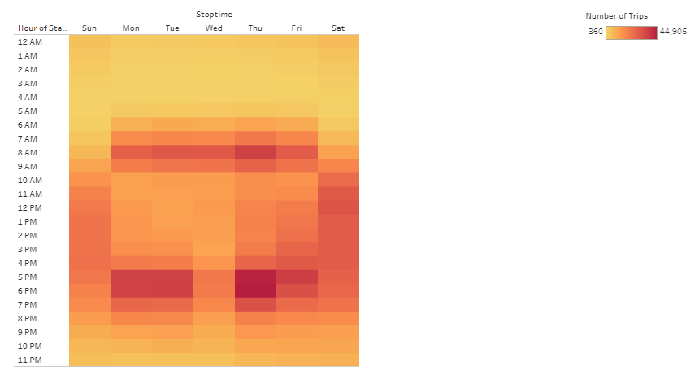
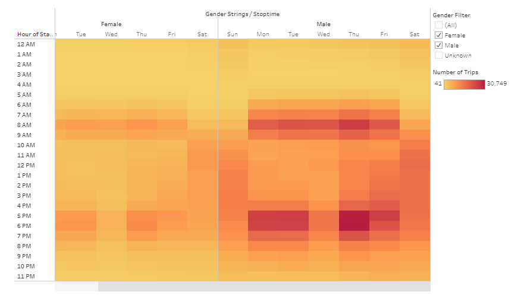
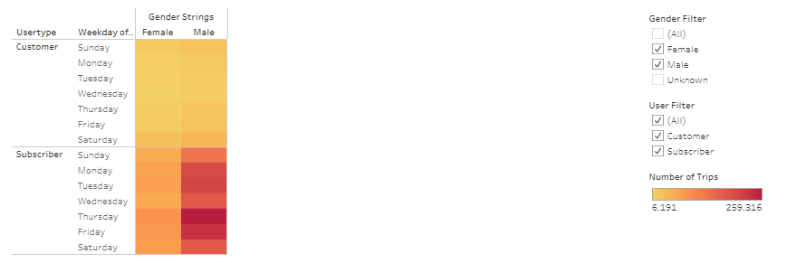
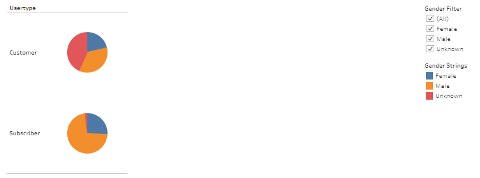

# Bikesharing: a pitch to open a bike sharing company in Des Moines

## Overview
Bike sharing is a successful service in New York city and may also make for a profitable business in Des Moines.  The linked to Tableau document displays information about usage of bikes in New York City collected by CitiBike to convince potential investors that this business model will be feasible in Des Moines.

## Results
### Resources
[Original Data](https://s3.amazonaws.com/tripdata/201908-citibike-tripdata.csv.zip)

### Analysis
The data linked to above was downloaded and used as is with two exceptions.  1) The tripduration column was provided as an integer.  A [python script](NYC_Citibike_Challenge.ipynb) was used to convert this column into datetime format.  2) The gender column was provided as an integer, where 0 = unknown, 1 = male, and 2 = female.  A Tableau calculated field converting the numbers to their corresponding string value as described above was used to create the gender strings column.  All figures were made using Tableau.  For most plots, unknown gender was omitted, because this group accounted for a relatively small number of users.

### Tableau Link
[Tableau Viz](https://public.tableau.com/views/Module14ChallengeBikeShareViability/BikeShareViability?:language=en-US&publish=yes&:display_count=n&:origin=viz_share_link)

### Figures

**Figure 1:** The number of trips taken at each hour during the day for the month of August.  Bikes are used for most of the daylight hours into the early evening, but there are to peaks around 7AM and 5PM.

**Figure 2:** The length of time bikes were checked out.  Most users were in possession of their bike for less than 30 minutes.

**Figure 3:** The length of time bikes were checked out by gender.  Most users were in possession of their bike for less than 30 minutes.  Although there are more males using bikes, their behavior appears to be similar to the behavior of females, because both groups show similarly shaped curves, with a peak around 10 minutes and a slight shoulder at 30 minutes.

**Figure 4:**  Frequency of bike usage by hour and day.  On the weekends, bikes are used fairly uniformly throughout the daylight hours.  On weekdays, however, there are spikes in activity between 7-9AM and 5-7PM.  This is consistent with the data in **Fig 1**, and clarifies that these peaks in activity are likely related to morning and evening rush periods.

**Figure 5:**  Frequency of bike usage by hour and day for each gender.  Males and females show similar patterns of usage peaks and troths.

**Figure 6:** Bike usage for customers and subscribers depending on gender.  There seems to be little difference in the way bikes are used between genders and customers subscribers.  The only noticeable difference is that customers may be more likely to use bikes on the weekends (perhaps capturing tourist activity) while subscribers are more likely to use bikes during the week.  All other differences in color appear to be accounted for by the number of subscribers versus customers and the greater number of male users (see **Figs 7** and **8**).

**Figure 7:** Breakdown of users by gender.  There are more male users of the New York city Bike share Citibike.

**Figure 8:**  Breakdown of users by user type and gender.  Although there are more male subscribers, it is unclear if male customers are the majority, as there is a large percentage of customers with unknown gender.

## Summary

### This Analysis

The data show that the majority of Citibike rides are taken by workday commuters, thus the success of bike sharing is New York City would not be expected to be a New York City-specific phenomenon.  Any city wherein commuters live within biking distance from work would be able to support such a business.  Given that the majority of bike rides last less than 30 minutes, within this timeframe is a suitable definition for “within biking distance.”  Of note is the gender disparity between males and females.  Males were much more likely to be subscribers and are likely to make up the majority of non-subscribing customers.  Given that both males and females work at approximately equal rates in the modern era, it seems like bike sharing should be a viable option for females at a higher frequency that what was observed.  Perhaps this is because females are still expected to fulfill traditionally female tasks (e.g. dropping of children at school or daycare) which requires females to need vehicles more than males.  However, it is also possible that bike sharing was more heavily marketed towards males in New York City.  If this is the case, then the Des Moines business could launch with the expectation of marketing more equally to working males and females to receive a larger number of customers overall than would be obtainable by simply copying the New York City model.  In total, bike sharing is expected to be viable in Des Moines and the new company will be able to start with an advantage in understating the needs of its future customers based on the analysis done here.

### For the Future

On a side note, it would be nice for the proposed company to decide whether it interested in biological/legal sex data (e.g. Male, Female, Intersex) or gender data (e.g. Man, Woman, Nonbinary, Two-Spirit, ect) and not conflate the terminology between these two disparate concepts during data aquisition.
